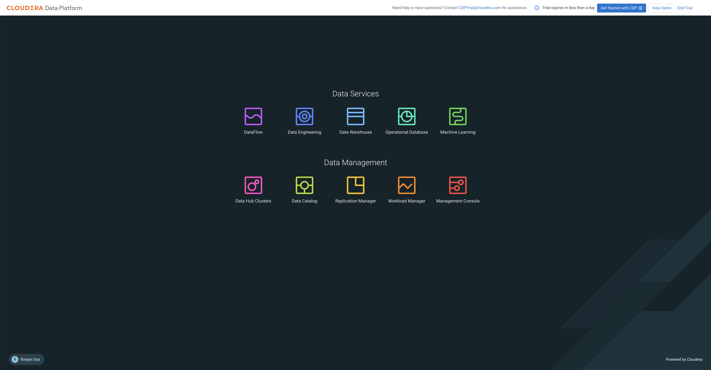

# 00_prereqs

As part of the `Prerequisites`, we will walk through the initial setup and configuration steps needed in your environment before we can proceed with the `Ingest` phase labs, including:

- Set your **Workload Password** for your CDP user
- Decide on a unique **Prefix** that will identify the databases you will create
- Deploy a new Machine Learning (ML) project
- Configure and deploy an Applied Machine Learning Prototype (AMP)

## Lab 1: Setup Workload Password for User

1. Set your CDP Workload Password

    a. In your CDP Home Page

    b. In the bottom left corner, find your user ID and click on it. In the popup, click on `Profile`

    

    c. On the User Profile page, click on `Set Workload Password`

    

    d. Enter a strong password, confirm it, and click on `Set Workload Password`

    

    - You should see a message that the Workload password has been updated.

    

2. In Cloudera Machine Learning (CML), provide your CDP Workload Password

    a. Open Cloudera Machine Learning (CML)

    - Click the bento menu icon in the top left corner and select `Machine Learning`

    

    b. Note the name of the environment, listed under the `Environment` column, as it will be used as one of the inputs while we create our Machine Learning model.

    c. Click on the workspace name link, found under the `Workspace` column

    

    d. Click on your user ID in the top right corner, and click

    

    e. On the User Profile page, click on the `Environment Variables` tab

    

    f. Enter your Workload Password from **Step 2** in `WORKLOAD_PASSWORD` and click `Save`

    

# Cloudera Machine Learning (CML) Project

In this phase, we will be deploying an end\-to\-end machine learning project that will also be used in the [03_visualize](03_visualize.md) and [04_predict](04_predict.md) phases.

## Lab 2: Deploy an ML AMP

1. Open Cloudera Machine Learning (CML)

    - If you just completed providing our Workload Password to CML, click on `Home` in the left navigation menu.

    - If not, you can always go back to the CDP Home Page by clicking the bento menu icon in the top left corner, click on `Home`, select the `Machine Learning` tile, and click on the available Workspace on the Machine Learning page (found under the `Workspace` column).

    
    
    

2. Click AMPs in the left menu

    

3. Cloudera Machine Learning (CML) will show you a catalog of available Machine Learning Prototypes

4. Search for the Canceled Flight Prediction prototype by entering `cancel` in the search box and clicking the prototype tile

    

5. Now click `Configure Project`

    

6. Wait for the Project to be created on the Project page \(takes a few seconds to load the code locally\)

    

We have now created a Cloudera Machine Learning (CML) Project that will be populated with all of the content making up the AMP we just deployed. This includes data, code, files, model definition, and a Flask application.

## Lab 3: Configure and Deploy Canceled Flight Prediction AMP

1. Open the created Cloudera Machine Learning (CML) Project you just created, named "Canceled Flight Prediction - &lt;user-id>" by clicking on the Project tile

    

2. CML will now give the user a series of Environment Variables to fill in. Fill as below:

    - For this step, you will need to choose a **Prefix** that will uniquely identify the databases you will create in the labs (e.g. `evolve`)

        - `STORAGE_MODE` as local
        - `SPARK_CONNECTION_NAME` with the Environment Name we collected above.
        - `DW_DATABASE` as `<prefix>_airlines` - where `<prefix>` is the unique database name prefix you will reference in other labs
        - `DW_TABLE` as `flights`
        - `USE_PREBUILT_MODEL` as `no`
        - Enable the button next to `Enable Spark`

3. Leave the rest of the fields with their default values.

4. Click `Launch Project`

    - It takes a few minutes to run the Jobs to build and deploy an end\-to\-end machine learning project

    

Cloudera Machine Learning will automatically execute the following 10 steps:

`Step 1:` Job to install dependencies

`Step 2:` Running the install dependencies job

`Step 3:` Job to process the raw data files

`Step 4:` Running job to process raw data files

`Step 5:` Job to train the model

`Step 6:` Run the model training job

`Step 7:` Create the flight delay prediction model API endpoint

`Step 8:` Build the model

`Step 9:` Deploy the model

`Step 10:` Start the Application

You can follow the executed step by clicking on the `View details` page to see the progress and what the prototype execution looks like in the background.

All the steps above should be successful before proceeding to the next steps. It takes roughly 8 minutes for the prototype to be deployed. You should see a `Completed all steps` message above the executed steps.

