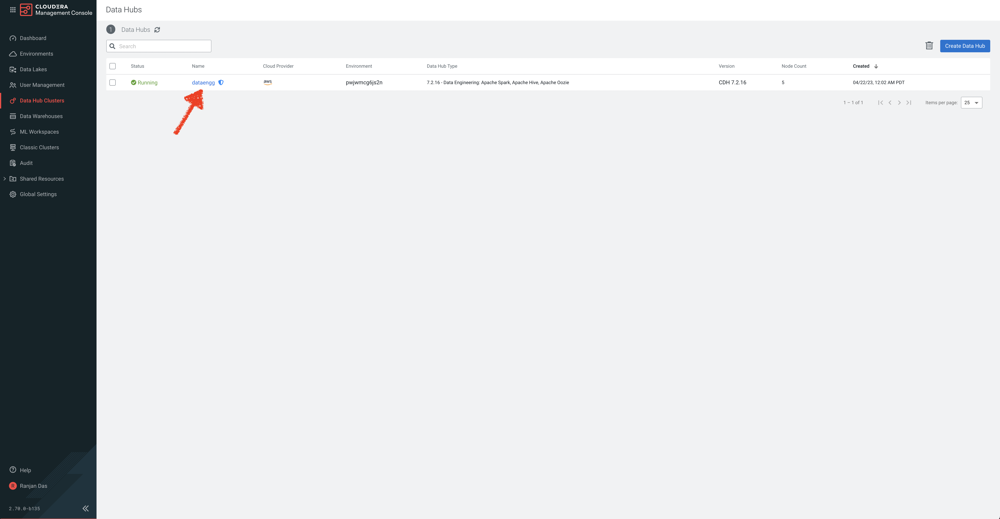
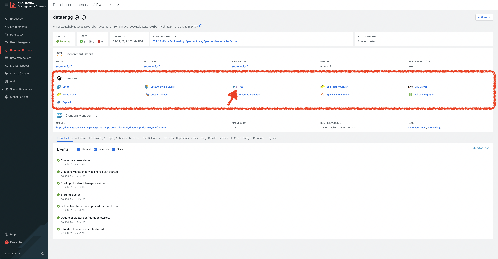
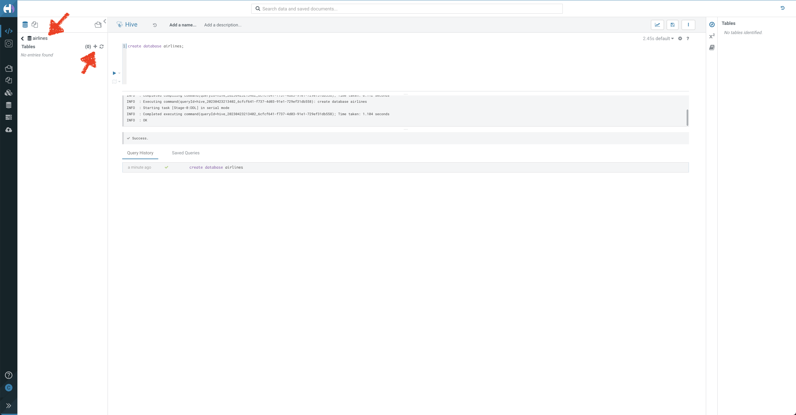
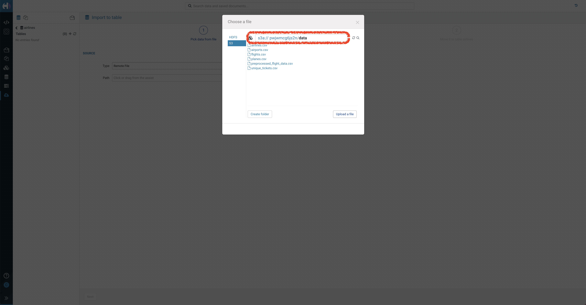
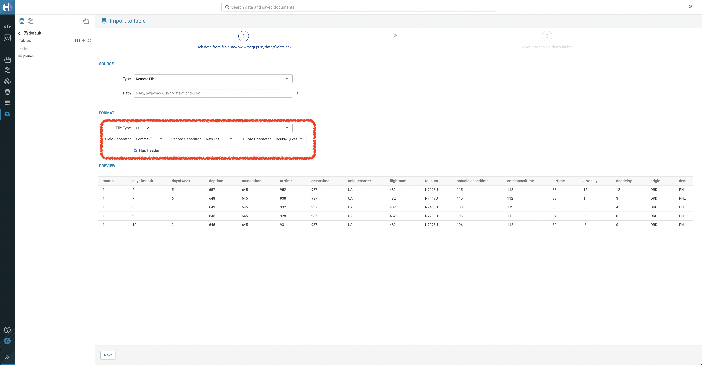
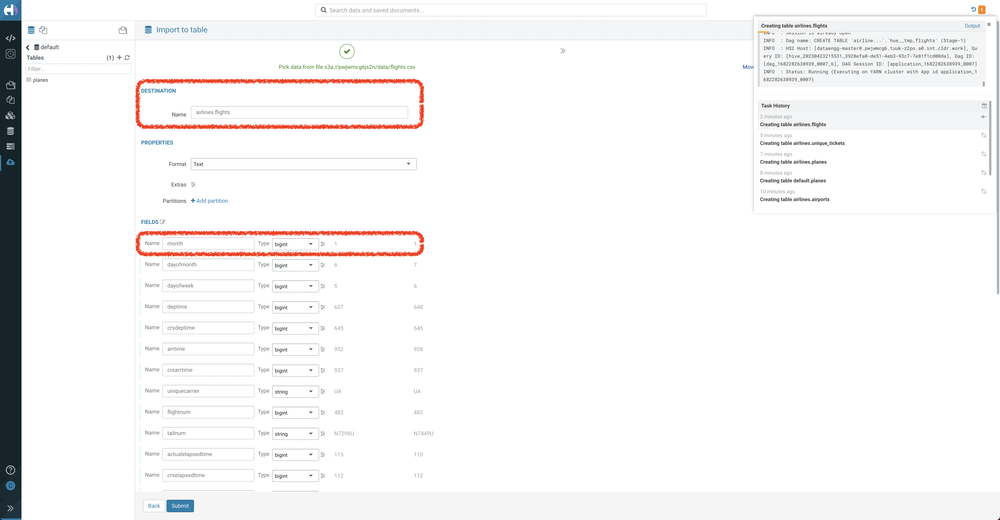
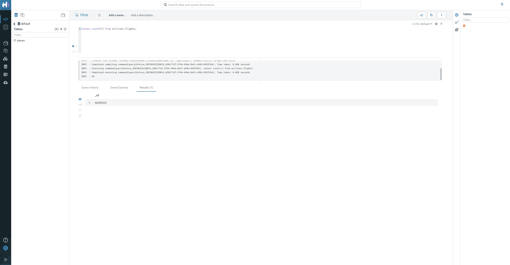

# 01_ingest

In this lab, we will ingest data from an S3 Bucket into Hive Tables using Hue. 

In a pattern that we will release shortly, we will use Cloudera Data Flow (CDF) to ingest data from numerous other sources. 

The primary goal of this is to build an ingestion data pipeline.
- Source data is pre-loaded in an S3 Bucket in CSV format. There are 5 datasets that we need to ingest into Hive.
    - Flights data
    - Airports data
    - Planes data
    - Airlines data
    - Passenger data
- We connect to the source bucket and pull all 5 datasets and ingest into the CDP Data warehouse (Hive in this case) for further analysis in [Analyze](02_analyze.md) phase.

## Lab 1: Ingest Flights data needed for Prediction

- In this lab, we will ingest **Flights data** from a source S3 Bucket into Hive Data warehouse. 
- Note that this is a large dataset and it will take a few minutes to ingest this data. 
- With just Flights data, we can continue to Prediction (As part of Lab 2, we will ingest the remaining tables that is needed for Analyze and Visualize).

1. In your CDP Home Page, click on **Data Hub Clusters**. (For more information about Data Hub, here is a [product tour](https://www.cloudera.com/products/data-hub/cdp-tour-data-hub.html))


2. In the Data Hub Clusters landing page, click on the Data Hub called **dataengg**. 



3. In the list of Services in the Data Hub, click on **Hue** to access Hive.



4. You will be taken to Hive Editor. Create a database called **airlines** using the below query - 

```
create database airlines;
```
5. Go inside the airlines database and click **+** to create a table by importing from a CSV file



6. You will be taken to **Import to table** screen. Keeping _Remote File_ as Type, click **..** in the Path. 
7. Select S3 and you will see file path as s3a://<environment_name>/user/<user_name>. **Change path to s3a://<environment_name>/data**.

Source files have been pre-loaded to the S3 folder, _data_



8. Select **flights.csv**. The file will be parsed and the appropriate columns will be identified. 
9. Ensure that "Field Separator" is Comma(,) and "Has Header" is selected. Click Next.



10. In the Next Screen, verify that the Destination Name is **airlines.flights**. 

Also, ensure that **month** is of Type **bigint** (At times, it is identified as boolean). 



11. Click Submit. This is a file with 462 Million records, it will take a 3 - 4 minutes to import into the table. 
12. Query the newly loaded table, execute the below query - 

```
select count(*) from airlines.flights;
```



13. From here, you can go to Lab 2 to ingest the remaining files or you can head to [lab around Predict](04_predict.md) to build an end-to-end machine learning project using Cloudera Machine Learning

## Lab 2: Ingest into other Tables needed for Analysis and Visualization

1. Similar to how flights.csv was uploaded, we will upload other csv files present in s3a://<environment_name>/data.
2. In airlines database, click + to go to "Import to table" screen.
3. Select the each of the below files to create appropriate tables
    - airlines.csv
    - airports.csv
    - planes.csv
    - unique_tickets.csv
4. Ensure that "Field Separator" is Comma(,) and "Has Header" is selected.
5. In the Next Screen, verify that the Destination Name is **airlines.<table_name>**.
6. Each of these files have a few 1000 records and import will happen in minutes.

We are now ready to [Analyze](02_analyze.md), [Visualize](03_visualize.md) and [Predict](04_predict.md) Data!
