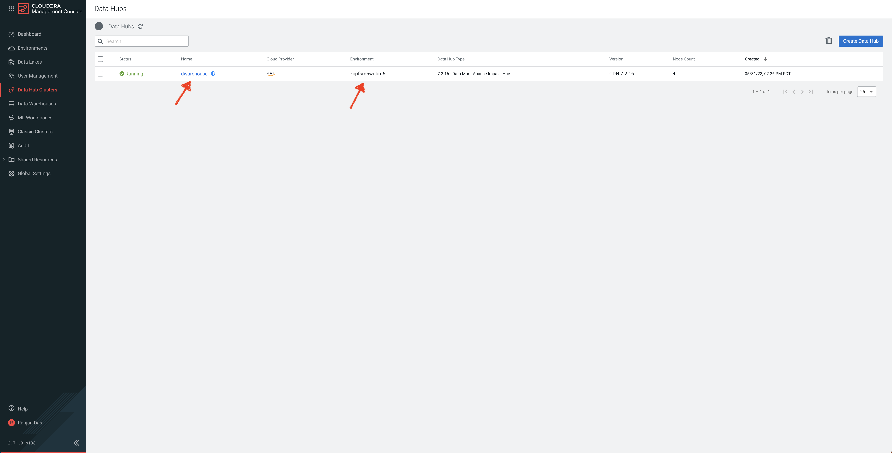

# 01_ingest

In this lab, we will ingest data from an S3 Bucket into Impala Tables using Hue. 

In a pattern that we will release shortly, we will use Cloudera Data Flow (CDF) to ingest data from numerous other sources. 

The primary goal of this is to build an ingestion data pipeline.
- Source data is pre-loaded in an S3 Bucket in CSV format. There are 5 datasets that we need to ingest into Impala.
    - Flights data
    - Airports data
    - Planes data
    - Airlines data
    - Passenger data
- We connect to the source bucket and pull all 5 datasets and ingest into the CDP Data warehouse (Impala in this case) for further analysis in [Analyze](02_analyze.md) phase.

## Lab 1: Ingest Flights data needed for Prediction

- In this lab, we will ingest **Flights data** from a source S3 Bucket into Impala Data warehouse. 
- Note that this is a large dataset and it will take a few minutes to ingest this data. 
- With just Flights data, we can continue to Prediction (As part of Lab 2, we will ingest the remaining tables that is needed for Analyze and Visualize).

1. In your CDP Home Page, click on **Data Hub Clusters**. (For more information about Data Hub, here is a [product tour](https://www.cloudera.com/products/data-hub/cdp-tour-data-hub.html))


2. In the Data Hub Clusters landing page - 

   a. **Note the Environment Name** as it will be used as one of the inputs while we create tables
   
   b. Click on the Data Hub called **dwarehouse**. 



3. In the list of Services in the Data Hub, click on **Hue** to access Impala.


4. You will be taken to Impala Editor. Create a database called **airlines** using the below query - 

```
create database airlines;
```

5. Create **flights** table

```
drop table if exists airlines.flights;

CREATE EXTERNAL TABLE airlines.flights (month int, dayofmonth int, dayofweek int, deptime int, crsdeptime int, arrtime int, crsarrtime int, uniquecarrier string, flightnum int, tailnum string, actualelapsedtime int, crselapsedtime int, airtime int, arrdelay int, depdelay int, origin string, dest string, distance int, taxiin int, taxiout int, cancelled int, cancellationcode string, diverted string, carrierdelay int, weatherdelay int, nasdelay int, securitydelay int, lateaircraftdelay int, year int)
ROW FORMAT DELIMITED FIELDS TERMINATED BY ',' LINES TERMINATED BY '\n'
STORED AS TEXTFILE LOCATION 's3a://${cdp_environment_name}/trial-odlh-data/airline-demo-data/flights' tblproperties("skip.header.line.count"="1");

```

* In **cdp_environment_name** field, enter the environment name you captured earlier

6. Query the newly created table, execute the below query - 

```
select count(*) from airlines.flights;
```


13. From here, you can go to Lab 2 to ingest the remaining files or you can head to [lab around Predict](04_predict.md) to build an end-to-end machine learning project using Cloudera Machine Learning

## Lab 2: Create other Tables needed for Analysis and Visualization

1. Similar to how airlines.flights was created, we will create other tables with data pre-loaded in S3.
2. Execute the below queries to create the following tables - planes, airlines, airports, unique_tickets

    a. Create **planes** table

```
drop table if exists airlines.planes;

CREATE EXTERNAL TABLE airlines.planes (tailnum string, owner_type string, manufacturer string, issue_date string, model string, status string, aircraft_type string, engine_type string, year int)
ROW FORMAT DELIMITED FIELDS TERMINATED BY ',' LINES TERMINATED BY '\n'
STORED AS TEXTFILE LOCATION 's3a://${cdp_environment_name}/trial-odlh-data/airline-demo-data/planes' tblproperties("skip.header.line.count"="1");
```

   b. Create **airlines** table    

```

drop table if exists airlines.airlines;

CREATE EXTERNAL TABLE airlines.airlines (code string, description string) 
ROW FORMAT DELIMITED FIELDS TERMINATED BY ',' LINES TERMINATED BY '\n'
STORED AS TEXTFILE LOCATION 's3a://${cdp_environment_name}/trial-odlh-data/airline-demo-data/airlines' tblproperties("skip.header.line.count"="1");

```

   c. Create **airports** table

```
drop table if exists airlines.airports;

CREATE EXTERNAL TABLE airlines.airports (iata string, airport string, city string, state string, country string, lat DOUBLE, lon DOUBLE)
ROW FORMAT DELIMITED FIELDS TERMINATED BY ',' LINES TERMINATED BY '\n'
STORED AS TEXTFILE LOCATION 's3a://${cdp_environment_name}/trial-odlh-data/airline-demo-data/airports' tblproperties("skip.header.line.count"="1");

```

   d. Create **unique_tickets** table

```
drop table if exists airlines.unique_tickets;

CREATE external TABLE airlines.unique_tickets (ticketnumber BIGINT, leg1flightnum BIGINT, leg1uniquecarrier STRING, leg1origin STRING,   leg1dest STRING, leg1month BIGINT, leg1dayofmonth BIGINT,   
 leg1dayofweek BIGINT, leg1deptime BIGINT, leg1arrtime BIGINT,   
 leg2flightnum BIGINT, leg2uniquecarrier STRING, leg2origin STRING,   
 leg2dest STRING, leg2month BIGINT, leg2dayofmonth BIGINT,   leg2dayofweek BIGINT, leg2deptime BIGINT, leg2arrtime BIGINT ) 
ROW FORMAT DELIMITED FIELDS TERMINATED BY ',' LINES TERMINATED BY '\n' 
STORED AS TEXTFILE LOCATION 's3a://${cdp_environment_name}/trial-odlh-data/airline-demo-data/unique_tickets' 
tblproperties("skip.header.line.count"="1");

```

We are now ready to [Analyze](02_analyze.md), [Visualize](03_visualize.md) and [Predict](04_predict.md) Data!
