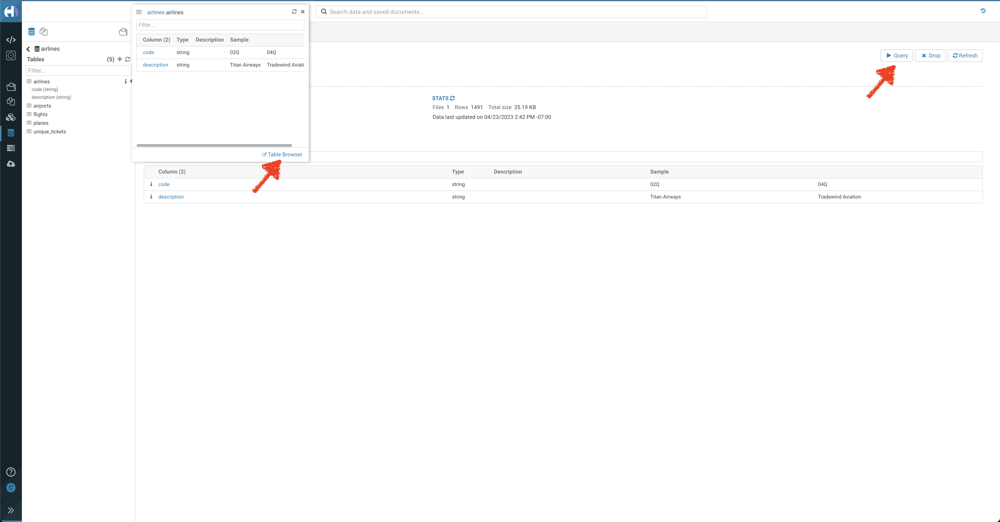
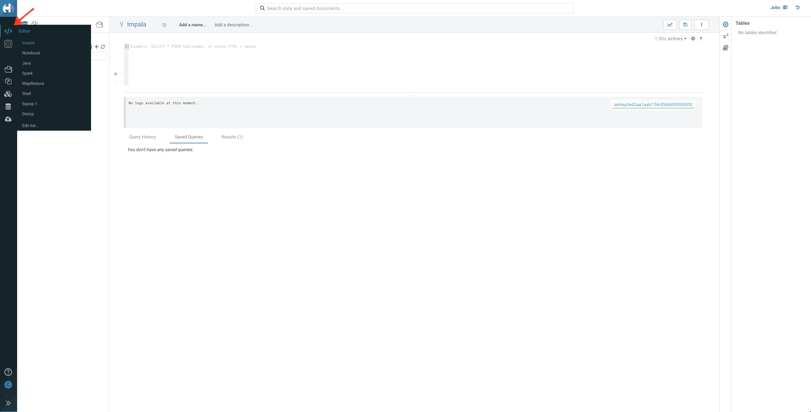

# 02_analyze

As part of the `Analyze` phase, we will run an interactive analysis of the data we brought in through a data pipeline into Cloudera's Data Lakehouse using Impala.

## Prerequisites

- Please ensure that you have completed [01_ingest](01_ingest.md#lab-2-create-an-open-data-lakehouse-powered-by-apache-iceberg) to ingest the data needed for analysis.

## Lab 1: Explore the Ingested Data

1. We will continue to analyze the data using Hue.
2. In the left pane, you will see a catalog of all the `databases` available. Click on `<prefix>_airlines`, where `<prefix>` is the prefix you used in the **01_ingest phase**
3. In the left pane, you will now see a list of all the `tables` ingested through your ETL/ELT pipeline in the [ingest phase](01_ingest.md#lab-2-create-an-open-data-lakehouse-powered-by-apache-iceberg)
4. You can now click on the table name to explore the schema of the table and run any sample queries to explore the dataset



## Lab 2: Build Business Intelligence Reports

We will now run interactive queries to build Business Intelligence (BI) reports. The business wants to build a Passenger Manifest and Layover Reporting dashboard to get actionable insights out of the data.

You can run the below queries on the interactive query editor.

1. Click on Editor > Impala to go to your interactive editor



- The Data Lakehouse that was created in the 01_ingest phase can answer many different questions to solve business problems, such as:
     1. Which Routes (origin airport to destination airport) have the highest average flight delays?  This can be used to assist in determining which Routes to concentrate resources to decrease the chance of delay.
     2. Which Carriers (airlines) have the highest percentage of cancelled flights?  This can be used to see if certain Carriers are outside the normal cancellation percentage and if so this information can help determine which Carrier to fly or not fly.
     3. Which Carriers should we partner with to offer coupons to Passengers on International flights with long layovers in order to help drive additional purchases at our Duty-Free stores?
- Execute each of the following queries to answer these burning business questions - 

**Query 1:** Which Routes (origin airport to destination airport) have the highest average flight delays?

```
SELECT
   CONCAT_WS('-',origin,dest) AS route,
   AVG(NVL(depdelay,0)) AS avg_departure_delay,
   COUNT(*) AS num_flights
FROM
   ${prefix}_airlines.flights
GROUP BY
   CONCAT_WS('-',origin,dest)
HAVING
   COUNT(*) > 1
ORDER BY
   avg_departure_delay DESC;
```


**Query 2:** Which Carriers (airlines) have the highest percentage of cancelled flights?

```
SELECT
   uniquecarrier,
   SUM(NVL(cancelled,0)) / COUNT(*) * 100 AS pct_cancelled_flights
FROM
   ${prefix}_airlines.flights
GROUP BY
   uniquecarrier
ORDER BY
   pct_cancelled_flights DESC;
```


**Query 3:** Passengers on International flights with long layovers by Carrier?
- International flights: flights where the destination airport country is not the same as the origin airport country
- All of the International flights have 2 Legs for each passenger
- Long layover: departure time of 2nd leg is more than 90 from the 1st leg's arrival time

```
SELECT
   a.leg1uniquecarrier AS carrier,
   COUNT(*) AS passengers
FROM
   ${prefix}_airlines.unique_tickets a,
   ${prefix}_airlines.flights o,
   ${prefix}_airlines.flights d,
   ${prefix}_airlines.airports leg1origin,
   ${prefix}_airlines.airports leg2dest
WHERE
   a.leg1flightnum = o.flightnum
   AND a.leg1uniquecarrier = o.uniquecarrier
   AND a.leg1origin = o.origin
   AND a.leg1dest = o.dest
   AND a.leg1month = o.month
   AND a.leg1dayofmonth = o.dayofmonth
   AND a.leg1dayofweek = o.`dayofweek`
   AND a.leg2uniquecarrier = d.uniquecarrier
   AND a.leg2origin = d.origin
   AND a.leg2dest = d.dest
   AND a.leg2month = d.month
   AND a.leg2dayofmonth = d.dayofmonth
   AND a.leg2dayofweek = d.`dayofweek`
   AND a.leg1origin = leg1origin.iata
   AND a.leg2dest = leg2dest.iata

   AND leg1origin.country <> leg2dest.country
   AND a.leg2deptime - a.leg1arrtime > 90

GROUP BY
   a.leg1uniquecarrier
ORDER BY
   COUNT(*) DESC;
```


Now that we know we can answer many burning business questions with this data, we need to get the analytic power into the hands of our Business Users.  Since they are not as familiar with writing complex SQL, we need to give them visualizations of the data so they can discover insights from the data.

We are now ready to [Visualize](03_visualize.md#03_visualize) the data.
