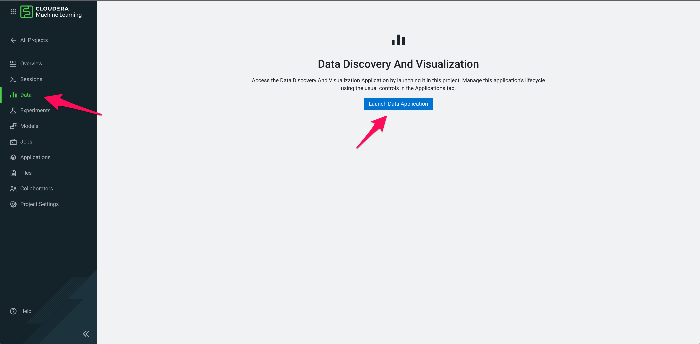
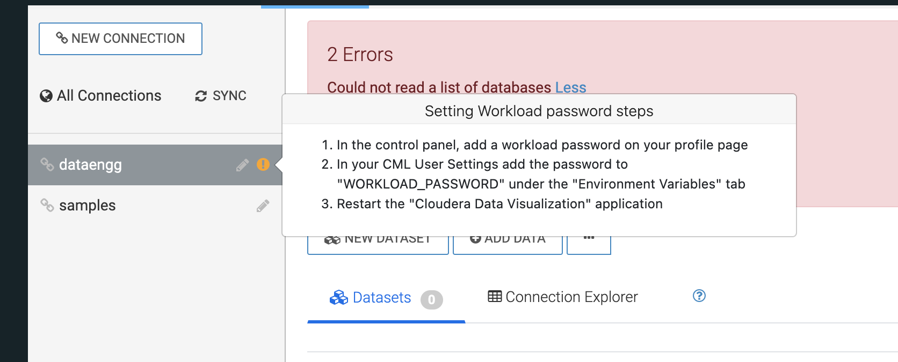
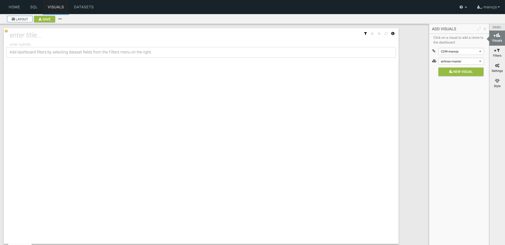
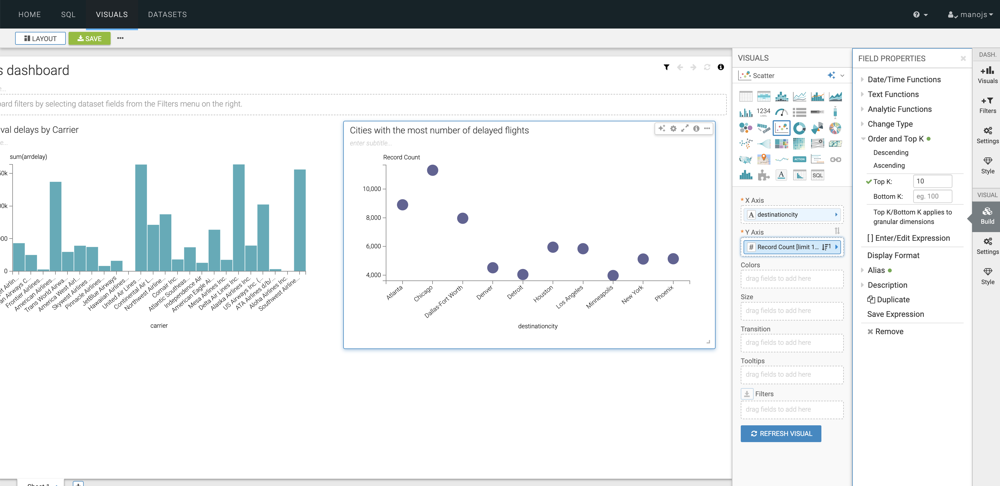
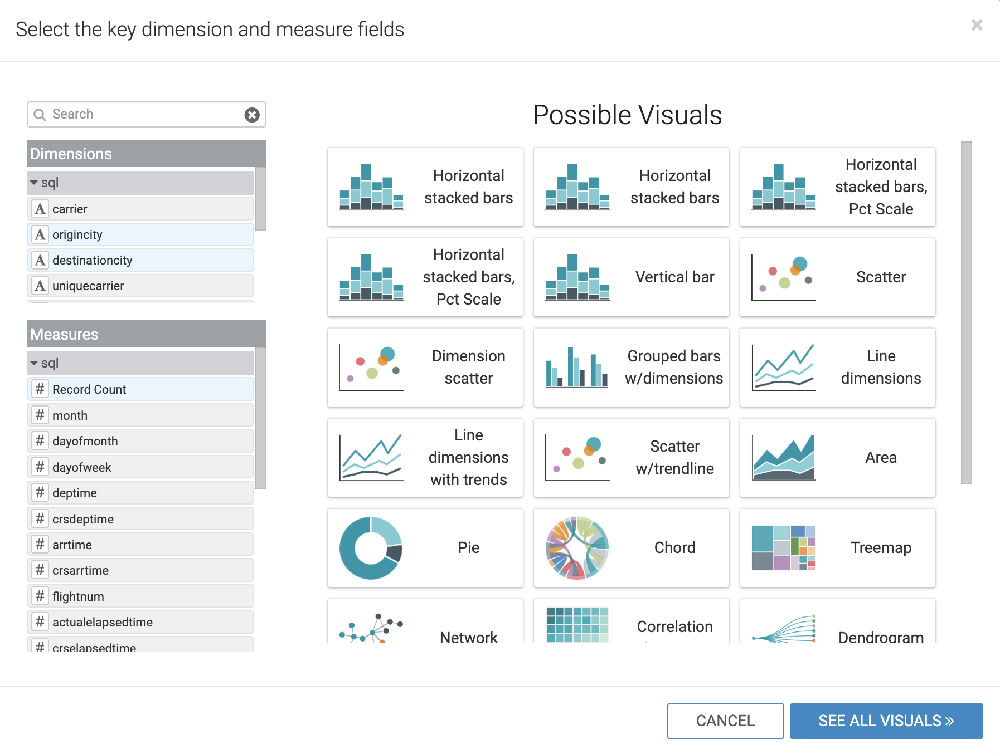
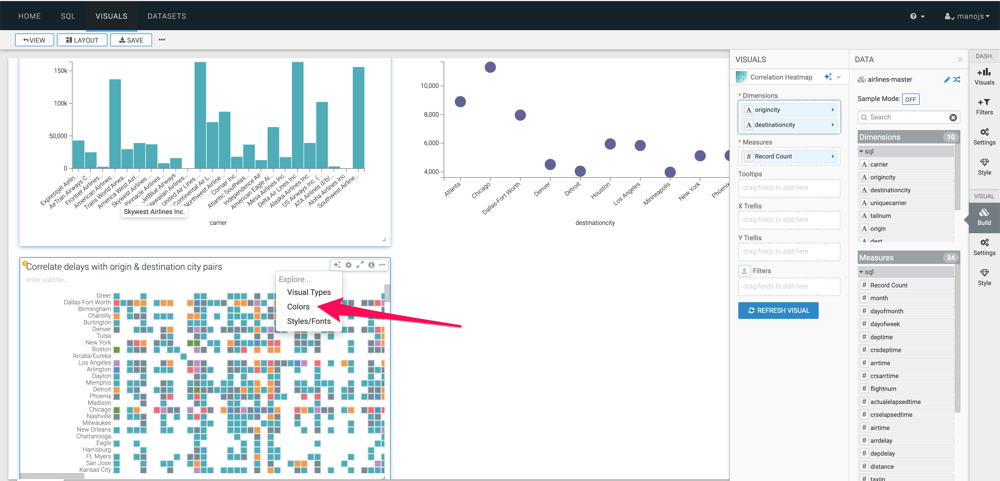

# 03_visualize

# Embedded Data Visualizations

## Pre-requisite

1. Please ensure that you have completed the [labs](01_ingest.md#01_ingest) to ingest data needed for Visualization.

## Lab 1: Enable data visualization:

1. Go to your Machine Learning workspace
2. Now create a `New Project` and name it `Embedded-DataViz` . Leave the other fields as is and click `Create Project`
3. On the left pane, you will see a tab called `Data` and then `Launch Data Application`.

It will take a few minutes for the data application to launch.



---

## Lab 2: Create a dataset

In this lab, we will create a dataset that contains a correlation across the various datasets we have ingested and prepare for creating visualizations.

1. Once you create a project as described in `Lab 1`, click on the `Data` tab then on `All Connections` tab. You should see a connection containing the name `dwarehouse`. Click this.
2. You may see an error - `Could not read a list of databases`. This is due to **Workload Password** not being set. Based on the instructions to update your "WORKLOAD_PASSWORD", please update workload password and restart the application.
    
    * Note that you will need to setup the workload password in **two** places
        * In the Control Plane - From CDP Home Page, by clicking on your profile in the left bottom of the page, it will take you to User Management screen in Cloudera Management Console. Head back to Cloudera Machine Learning (CML).
        * In CML User Settings (User Settings is the last menu item in your Machine Learning Workspace) - Save the WORKLOAD_PASSWORD again in Environment Variables tab



3. Now click `New Dataset`
4. `Dataset title` as `airlines-master`
5. `Data Source` as `From SQL`
6. Enter the below SQL query into the field:

```
select B.description as 'carrier', C.city as 'origincity', D.city 'destinationcity', A.*,
CAST(CONCAT(CAST(`year` AS STRING) , '-', CAST(`month` AS STRING), '-', CAST(`dayofmonth` AS STRING))
AS DATE FORMAT 'yyyy-mm-dd') as flightdate
from airlines.flights A
INNER JOIN airlines.airlines B ON A.uniquecarrier = B.code
INNER JOIN airlines.airports C ON A.origin = C.iata
INNER JOIN airlines.airports D ON A.dest = D.iata
```

7. Click `Create`

## Lab 3: Create a dashboard

In this lab, we will create a sample dashboard to visualize the reports for a business user.

1. Click on the `dataset` we created in Lab 2 and then click `New Dashboard` icon.


2. We will now create 3 reports & charts in this dashboard
    1. Total arrival delays by Carrier
    2. Cities with the most number of delayed flights \(Top 10\)
    3. Correlate delays with origin & destination city pairs

### Total arrival delays by Carrier

1. Enter a the tile for the dashboard as `Airlines dashboard`
2. Click `Visuals`, then `New Visual`



1. Click `Grouped Bars` as the chart type
2. From the `Dimensions` shelf, drag the `carrier` field into the `X Axis` field
3. From the `Measures` shelf, drag the `arrdelay` field into the `Y Axis` field
4. Enter the title for this chart as `Total arrival delays by Carrier`


### Cities with the most number of delayed flights \(Top 10\)

We will create a scatter chart to identify the cities that have the most number of delayed flights

1. Click `Visuals`, then `New Visual`
2. Click `Scatter` as the chart type
3. Enter the name of the chart as `Cities with the most number of delayed flights (Top 10)`
4. From the `Dimensions` shelf, drag the `destinationcity` field into the `X Axis` field
5. From the `Measures` shelf, drag the `Record Count` field into the `Y Axis` field & double click on the field you just brought in.
6. We now want to only show the top 10 records.
    1. Under `Field Properties` , go to `Order` and `Top K` field, then to Top K
    2. Enter `10` as the value and click `Refresh Visual`



### Correlate delays with origin & destination city pairs

For this use\-case, we will let Cloudera Data Visualization recommend a chart type for us.

1. Click `Visuals`, then `New Visual`
2. Now click on `Explore Visuals`


1. In the pop-up window, choose `origincity` and `destinationcity` on the `Dimensions` shelf. `Record Count` on the `Measures` shelf
2. The `Possible Visuals` pane will show you a list of recommended visuals.
3. You can explore the various charts and then choose `Correlation Heatmap`
4. Name your chart as `Correlate delays with origin & destination city pairs`



7. You can change the color of correlation map by clicking on the `Explore Options` icon on top of the chart and then `Colors`, then choose a format you prefer



Click `Save` to save the dashboard.

As a nextstep, you can try creating a visual application based on the dashboard we just built and showcase how a business user dashboard could look like. The documentation is [here](https://docs.cloudera.com/data-visualization/7/howto-apps/topics/viz-create-app.html)
