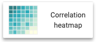

# 03_visualize

As part of the `Visualize` phase, we will be working to create a Dashboard using the Data Lakehouse we created in the [01_ingest](01_ingest.md) phase.

## Prerequisites

1. Please ensure that you have completed [00_prereqs](00_prereqs.md) to deploy the Applied Machine Learning Prototype (AMP) for `Canceled Flight Prediction`.
2. Please ensure that you have completed [01_ingest](01_ingest.md#01_ingest) to ingest the data needed for Visualizations.

## Lab 1: Create a Dataset

As part of deploying the AMP `Canceled Flight Prediction`, a Data Visualization application has been enabled.  We will dive into this Project in more detail during the [04_predict](04_predict.md#04_predict) phase.

In this lab, we will leverage the Data Visualization application to create a `Dataset` that contains a correlation across the various data we have ingested into our Data Lakehouse and prepare for creating visualizations.  

A `Dataset`, aka Data Model, is a logical representation of the data you want to use to build visuals. It is a logical pointer to a physical table or a defined structure in your data source. Datasets may represent the contents of a single data table or a data matrix from several tables that may be in different data stores on the same connection.

1. Open Cloudera Machine Learning (CML)

    a. Go to the CDP Home Page by clicking the bento menu icon in the top left corner and click on `Home`

    

    b. Select the `Machine Learning` tile.

    

2. Click on the available Workspace on the Machine Learning page (found under the `Workspace` column).

    

3. Click on the project previously created in [00_prereqs](00_prereqs.md).

    

4. Click on `Data` in the left navigation menu.

    

5. In the top menu bar, click `DATASETS`

    

    - Ensure the `dwarehouse` connection is selected.

    

6. Now click `New Dataset`

    The Dataset we want to create will join the `flights` Iceberg table to the `airports` Iceberg table for the Origin Airport details and again for the Destination Airport details 

    

    - **Dataset title** - `<prefix>-airlines-master`
    
        - Replace `<prefix>` with the prefix you chose in [00_prereqs](00_prereqs.md)

    - **Dataset Source** - `From Table`
    
        - Here you have the option of choosing between directly entering SQL or selecting tables from our Data Lakehouse.

    - **Select Database** - `<prefix>_airlines`

        - Replace `<prefix>` with the database prefix you chose in [00_prereqs](00_prereqs.md)
    
    - **Select Table** - `flights`

    - Click the `CREATE` button to create the Dataset (Data Model)

        

7. You will be taken back to the Datasets tab.  Under Title/Table, you will see the `<prefix>-airlines-master` Dataset we just created, click on it to open the Dataset.

    

8. On the left nav, click on `Data Model`.
    
    

9. To Join tables to the `flights` table, click on `EDIT DATA MODEL`

    

10. Click the `+` to the right of the `flights` table to join a table

    - **Database Name** - `<prefix>_airlines`

        - The database with the unique name prefix you created in [01_ingest](01_ingest.md#01_ingest)

    - **Table Name** - `airlines`

    - Click the `SELECT` button

        

    - If an `Edit Join` pops up, click `APPLY`

11. Click the `+` to the right of the `flights` table to join a table

    - This table will be used for joining against **origin** airports.

        - **Database Name** - `<prefix>_airlines`

        - **Table Name** - `airports`

        - Click the `SELECT` button

        

        -  If an `Edit Join` pops up, click `APPLY`

12. Click the `+` to the right of the `flights` table to join a table

    - This table will be used for joining against **destination** airports.

        - **Database Name** - `<prefix>_airlines`

        - **Table Name** - `airports`
    
        - Click the `SELECT` button

        

        - If an `Edit Join` pops up, click `APPLY`

13. Edit joins between `flights` and its dimension tables

    - Select  (join) between the flights table and each dimension table -
    
        - airlines
        - airports
        - airports_1
        
    - On `Join Details` for each, select `Left` join for the type of join, then select `EDIT JOIN`

        

    - On the `Edit Join` popup for each join

        

    a. Join between `flights` and `airlines`
   
    - Under `<prefix>_airlines.flights` choose `uniquecarrier` from the drop-down

    - Under `<prefix>_airlines.airlines` choose `code` from the drop-down

    - Click the `APPLY` button

        

    b. Join between `flights` and `airports` for the origin airport

    - Under `<prefix>_airlines.flights` choose `origin` from the drop-down

    - Under `<prefix>_airlines.airports` choose `iata` from the drop-down

    - Click the `APPLY` button
    
        

    c. Join between `flights` and `airports_1` for the destination (dest) airport

    - Under `<prefix>_airlines.flights` choose `dest` from the drop-down

    - Under `<prefix>_airlines.airports` choose `iata` from the drop-down

    - Click the `APPLY` button

        

14. To test if the Joins are working, click on `SHOW DATA`. You will see a table of data representing the `flights` table being joined to the `airports` table for the Origin and Destination airport details

    

15. Click the `SAVE` button

16. Click on `Fields` in the left nav.

    - When building a Dataset, it is common to:

        - Provide user-friendly names for columns
        - Create derived (calculate) attributes
        - Assign default behavior (Dimension or Measure) of a field
        - Change default aggregation of fields prevents common mistakes when building visuals

17. Click on `EDIT FIELDS`

18. Change the default behavior of Fields

    - Cloudera Data Visualization (CDV) will try to classify the columns from each table into a Category (ie. Dimension or Measure) to control the default behavior of the Field
    
    - Dimensions - data that you will not usually aggregate and instead this data will be treated like a string and used to display details in visuals (ie. in a Pie Chart it might be used as the pie slices)
    
    - Measures - would be fields that you would be aggregating (sum, count, average, etc.)
    
    - This is important as CDV will use this information to assist in easing repetitive work and simplify building visuals

    - Under Measures - Click the `Mes` toggle button next to the following Fields, this will change the Field to a `Dim` 

        - `month`
        - `dayofmonth`
        - `dayofweek`
        - `deptime`
        - `crsdeptime`
        - `arrtime`
        - `crsarrtime`
        - `flightnum`

        

19. Under `Dimensions > airlines`, click the pencil next to `description`

    - Change `Display Name` to Carrier
    - Click the `APPLY` button

    

20. Under `Dimensions > airports`, click the pencil next to `city`
   * Change `Display Name` to Origin City
   * Click the `APPLY` button

21. Under `Dimensions > airports_1`, click the pencil next to `airports_1 city`
   * Change `Display Name` to Destination City
   * Click the `APPLY` button

22. Add a derived field, `flightdate`

    - Sometimes the data in the base tables needs to be extended. There is no timestamp representing the flight date. So, instead of adding these expressions for every visual created we can define it here.

    a. Under Measures > flights, click the drop-down arrow to the right of `month`, select `Clone`

    b. Under Measures > flights, click the Pencil next to `Copy of month`

    - Change `Display Name` to `Flight Date`

        

    c. Click the `Expression` tab and paste the following

    ```
    CAST(CONCAT(CAST(`year` AS STRING) , '-', CAST(`month` AS STRING), '-', CAST(`dayofmonth` AS STRING))
    AS DATE FORMAT 'yyyy-mm-dd')
    ```

    - Click the `VALIDATE EXPRESSION` button to test if the expression is valid

    - Click the `APPLY` button

        

    d. After the Field is saved you will see it has automatically set the data type to a Timestamp, to the left of `Flight Date` you will see a drop-down and a calendar

    

23. Click the `SAVE` button to save the changes to the Dataset

    

- To compare what we just did to this Dataset, we can compare it to the following SQL

   `select B.description as carrier, C.city as origincity, D.city as destinationcity, A.*, CAST(CONCAT(CAST(year AS STRING) , '-', CAST(month AS STRING), '-', CAST(dayofmonth AS STRING)) AS DATE FORMAT 'yyyy-mm-dd') as flightdate from airlines.flights A LEFT OUTER JOIN airlines.airlines B ON A.uniquecarrier = B.code LEFT OUTER JOIN airlines.airports C ON A.origin = C.iata LEFT OUTER JOIN airlines.airports D ON A.dest = D.iata`

    - In this SQL you can see the Joins between Flights and Airlines; Flights and Airports for origin airport; and Flights to Airports for destination airport

    - You can also see that `B.description as carrier`, `C.city as origincity`, and `D.city as destinationcity` all represent renaming a base field to something more business related

    - And `CAST(CONCAT(CAST(year AS STRING) , '-', CAST(month AS STRING), '-', CAST(dayofmonth AS STRING)) AS DATE FORMAT 'yyyy-mm-dd') as flightdate` is of course adding a derived field

## Lab 2: Create a Dashboard

In this lab, we will create a sample dashboard to visualize the reports for a business user.

1. In the top menu bar, click `DATASETS`

    

2. Click on the `Dataset` we created in Lab 1 and then click the `New Dashboard` icon.

    

We will now create 3 visuals in this dashboard, as follows

- Total arrival delays by Carrier
- Cities with the most number of delayed flights \(Top 10\)
- Correlate delays with origin & destination city pairs

### Total Arrival Delays by Carrier

1. Enter the title for the dashboard as `<prefix> Airlines Dashboard`
   * Replace &lt;prefix> with your choosen prefix
    

2. When the Dashboard was created it automatically created a default visual.  This visual is a table showing data in the Dataset.
   * Hoover over the Table visual
   * Click no the `Configure` (gear) option 
    

3. On the right side of the screen under `VISUALS`, Click `Grouped Bars` as the chart type

    - 2nd row, 1st column
    

4. From the `Dimensions` shelf, drag the `Carrier` field into the `X Axis` shelf
    

5. From the `Measures` shelf, drag the `arrdelay` field into the `Y Axis` shelf

   - This will add `sum(arrdelay)` to the `Y Axis` shelf
    

6. Click `REFRESH VISUAL`

7. Enter the title for this chart as `Total arrival delays by Carrier` and hit `Enter`


### Cities with the Most Number of Delayed Flights \(Top 10\)

We will create a scatter chart to identify the cities that have the most number of delayed flights

1. Click `Visuals`, then `New Visual`


2. Click `Scatter` as the chart type, on the right side of the screen under `VISUALS`

    - 3rd row, 3rd column

3. Enter the name of the chart as `Cities with the most number of delayed flights (Top 10)` and hit `Enter`

4. From the `Dimensions` shelf, drag the `Destination City` field into the `X Axis` shelf

5. From the `Measures` shelf, drag the `Record Count` field into the `Y Axis` shelf

6. Click on the arrow to the right of the `Record Count` field you just dragged into `Y Axis` shelf

    - We now want only to show the top 10 records.

        a. Under the `FIELD PROPERTIES` section of the popup, click the `Order and Top K` field

        b. Next to `Top K`, enter `10` as the value and click `Enter`

6. Click `REFRESH VISUAL`


### Correlate Delays with Origin and Destination City Pairs

For this use case, we will let CDV recommend a chart type for us.

1. Click `Visuals`, then `New Visual`


2. Now click on `Explore Visuals`

    

3. In the pop-up window

    - Choose `Origin City` and `Destination City` under the `Dimensions` shelf
    
    - Choose `Record Count` under the `Measures` shelf

    

4. The `Possible Visuals` pane will show you a list of recommended visuals.

5. You can explore the various charts and then choose `Correlation Heatmap`

   

6. Give your new visual a title of `Correlate Delays with Origin & Destination City Pairs` and hit `Enter`

   

7. You can change the color of the correlation map by clicking on the `Explore Options` icon at the top of the chart. Select `Styles/Fonts`

    

   * Scroll through the list and choose a different style for this visual.
   

8. The completed Dashboard should look like the following
   

9. Finally, click the `SAVE` button at the top to save the dashboard.

10. At the top of the screen `VISAULS`, here you will see the saved Dashboard.  This is where you can go to view or continue editing the Dashboard 

   

As a next step, you can try creating a visual application based on the dashboard we just built and showcase what a business user dashboard could look like. The documentation is [here](https://docs.cloudera.com/data-visualization/7/howto-apps/topics/viz-create-app.html)

We are now ready to [Predict](04_predict.md#04_predict) the likelihood of a flight being canceled.