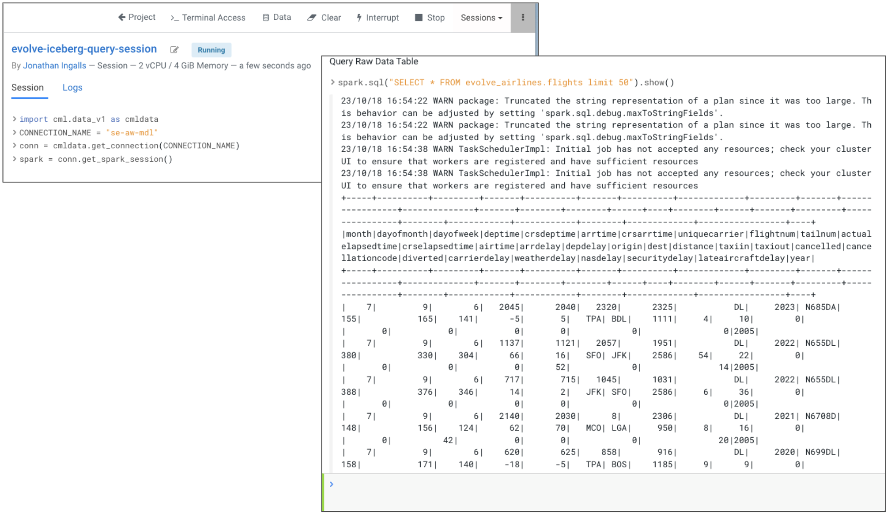

# 04_predict

As part of the `Predict` phase, we will explore and test the end\-to\-end machine learning project we created in [03_visualize - Lab 1](03_visualize.md#lab-1-deploy-machine-leaning-applied-machine-learning-prototype-amp) using Cloudera Machine Learning (CML).

The primary goal of this project we deployed is to build a gradient-boosted \(XGBoost\) classification model to predict the likelihood of a flight being canceled based on years of historical records. To achieve that goal, this project demonstrates the end\-to\-end Machine Learning journey for model training and inference using Spark on CML. Additionally, this project deploys a hosted model and front\-end application to allow users to interact with the trained model.

## Prerequisites

1. Please ensure that you have completed [00_prereqs](00_prereqs.md) to deploy the Applied Machine Learning Prototype (AMP) for `Canceled Flight Prediction`.
2. Please ensure that you have completed [01_ingest](01_ingest.md#01_ingest) to ingest the data needed for Visualizations.

## Lab 1 - Explore Machine Learning AMP Project

1. Open CML `Canceled Flight Prediction` project Overview page

    - If you just completed the [03_visualize](03_visualize.md#03_visualize) phase, in the left nav click on Overview.

    

    - If not, you can always go back to the CDP Home Page by clicking the bento menu icon in the top left corner, clicking on Home, selecting the `Machine Learning` tile, clicking on the Workspace available on your Machine Learning page (found under the `Workspace` column), find and select the `Canceled Flight Prediction` project tile.
   
    

    

    

2. Click on the project previously created in [00_prereqs](00_prereqs.md).

    

3. On the Overview page, you can preview the materials that were created as part of deploying the AMP.

    - AMPs are ML projects that provide reference examples to solving common problems in the machine learning field. More than simplified quickstarts or tutorials, AMPs are fully developed expert solutions that demonstrate how to fully use the power of CML. AMPs can be an excellent way to get started as they show you how to solve problems similar to your business use cases.

    

    - On the initial view into the `Canceled Flight Prediction` AMP Overview page, you will see the status bar which is a recap of what you executed in [03_visualize Lab 2](03_visualize.md#lab-2-configure-and-deploy-canceled-flight-prediction-amp)

    

    As you scroll down the right side of the screen, notice the following AMP component deployments:

    - `Models`

         - A model has been deployed and it is currently running
         
         - View the resources that are allocated to the running model

         - Models can be deployed in a matter of clicks, removing any roadblocks to production. 
         
         - Served as REST endpoints in a high availability manner, with automated lineage building and metric tracking for MLOps purposes.
         
        

    - `Jobs`

        - Can be used to orchestrate an entire end-to-end automated pipeline, including monitoring for model drift and automatically kicking off model re-training and re-deployment as needed.

        

    - `Files`

        - Browse the file folder structure to view how project assets are organized

        

    - `Applications`
      
      - Deliver interactive experiences for business users in a matter of clicks. 
      - Frameworks such as Flask and Shiny can be used in the development of these Applications, while Cloudera Data Visualization is also available as a point-and-click interface for building these experiences

    - `README.md` for Canceled Flight Prediction project that describes what this model is trying to accomplish and how to use it.

        

## Lab 2 - Explore and Test the Deployed Model

1. One of the steps that AMP executed was to productionalize the model and make it accessible via a REST API.

2. Click on the `Flight Delay Prediction Model Endpoint` model that was deployed.

    

    

3. We will now test the real-time scoring of the model that was just deployed. The `Test Model` section contains sample input populated automatically. You can also pass additional sample inputs, following the format of the provided sample.
    
    - Click `Test` button below the `Test Model` text field.

        

4. If we look closer at the test result, we see that our model was successfully executed with the test input provided and a prediction result of `1` is given back in the `Response`.

    - A value of `1` predicts that the flight will be delayed, while `0` means no flight delay is predicted.

    

## Lab 3 - Explore and Test the Application

The AMP deployed a visual dashboard to expose the results from the Machine Learning pipeline for the business users. In this lab, we will access the Analytical Application.

1. Click `Applications` in the CML left navigation menu to go to the Applications View page.

    

2. Click the `Application to serve flight prediction front end app UI` application tile.

    

    - This will take you to a visual dashboard

3. Here you can pass various inputs to the model and get a prediction with probability on whether or not a flight will be canceled.

    - Try changing any combination of the following inputs into the model and click the `Will it be canceled?` button to see the results returned from executing the model.

        - Carrier
        - Origin
        - Destination
        - Week
        - Departure Hour

    

## Lab 4 - Connect CML to Data Lakehouse

In this Lab we will create a new Python program that will connect to our Data Lakehouse we created in [01_ingest](01_ingest.md) phase and read the data into CML. To test out our code we will interact with a CML Session which allows us to run our code and provides access to an interactive command prompt and terminal.

Once you complete this lab, you will have now used 2 analytical tools to interact with the same, ***single copy*** of data or ***single source of truth*** from our Data Lakehouse. 

It is important to emphasize that there was no requirement to create a duplicate copy of the data. The same security policies that would be set up on this table also carry forward when using any Cloudera Data Service to access this data.

1. Return to CML - click browser tab `Applications - Cloudera Machine Learning`

    

2. In the left navigation menu, select `Files`

3. Click `+ New` in the top right corner, to create a New File

    

4. Provide file name and click `Create`

    - **File Name**: `iceberg_query.py`
    - Check the `Open in Editor` checkbox
    - Click the `Create` button

    

5. Start New Session
 
    - **Session Name:** `<prefix>-iceberg-query-session`

        - Replace `<prefix>` with the prefix you chose in [00_prereqs](00_prereqs.md)
   
    - Under `Runtime`

        - **Editor:** `Workbench` (Note: Other Editors are available)

        - **Kernel:** `Python 3.9`

        - **Edition:** `Standard`

        - **Version:** `<leave the default value>`

        - **Enable Spark:** `Enabled` (blue)
        
            - Select Spark 3.2.3 (Minimum: Spark 3.x is required for Iceberg functionality)

        - **Resource Profile:** `<leave the default value>`
        
            - Typically, you would select the appropriate resource profile needed for the task you are trying to accomplish

    - Click the `Start Session` button

    

6. From the Connection Code Snippet

    - Find and select the tile with **TYPE** = `Spark Data Lake`

    - Click the `Copy Code` button in the top right corner of the Code Snippet

    - Click `Close`

    

7. In the Workbench, paste the code into the Editor window on the left half of the screen

    - This code represents how you can connect to Spark

    

8. Add the following code to the end of the connection

    - Copy paste the following code, replacing `<prefix>` with your prefix, into the Workbench Editor after the code you copied connecting to the Spark Connection.  

    ```
    ### Code to add
    # Replace <prefix> with your prefix in the following code

    # Query Raw Data Table
    spark.sql("SELECT * FROM <prefix>_airlines.flights limit 50").show()
    ```

    

9. Once you’ve pasted the code at the end of the connection click on `Run` > `Run All`

    

    - In the Session output you will see:

        - Code starting and connecting to Spark

        - A list of databases in the `namespace` table, where you will see your 2 databases `<prefix>_airlines_raw` and `<prefix>_airlines` in the list
        
        - Results from the `flights` Iceberg table

    

10. To Save the Python code - from the left top menu, click `File` > `Save`

    

11. Stop the Session - in the top right corner click on `Stop`

    - This will free up the compute resources we were just using

    

Now we are ready to take a look at some of the interesting features Iceberg has to offer. Please visit [05_iceberg](05_iceberg.md) to explore key Iceberg features in more detail.
