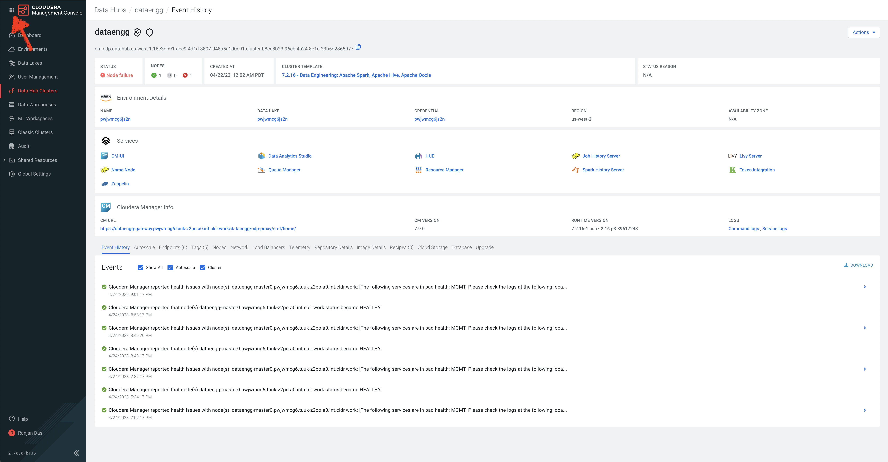

# 04_predict

In this lab, we will build an end\-to\-end machine learning project using Cloudera Machine Learning. The primary goal of this project is to build a gradient boosted \(XGBoost\) classification model to predict the likelihood of a flight being canceled based on years of historical records. To achieve that goal, this project demonstrates the end\-to\-end Machine Learning journey for model training and inference using Spark on CML. Additionally, this project deploys a hosted model and front\-end application to allow users to interact with the trained model.

## Pre-requisite

1. Please ensure that you have completed the [lab](01_ingest.md#lab-1-ingest-flights-data-needed-for-prediction) to ingest data needed for Prediction.

## Lab 1

You can always go back to CDP Home Page by clicking the bento menu icon in the top left corner of Data Hub page or Cloudera Machine Learning page

1. Select Machine Learning in Cloudera Data Platform Home Page

2. Note the **Environment Name** as it will be used as one of the inputs while we create our Machine Learning model.

3. Click on the workspace available in your Machine Learning Page
4. Once inside your workspace, Click AMPs in the left menu
5. Cloudera Machine Learning\(CML\) will show you a catalog of available Machine Learning Prototypes
6. Search for Canceled Flight Prediction prototype in the search box, click the prototype
7. Now click Configure Project
8. Wait for the Project to be created on the Project page \(takes a few seconds to load the code locally\)

1. Once complete, click on the project we just created
2. CML will now gives a series of Environment Variables for the user to fill in. Fill as below:
    1. `STORAGE_MODE` as external
    2. `SPARK_CONNECTION_NAME` with the Environment Name we collected above.
    3. `DW_DATABASE` as `airlines`
    4. `DW_TABLE` as `flights`
    5. `USE_PREBUILT_MODEL` as `yes`
3. Leave the rest of the fields to be default.
4. Click Launch Project

Cloudera Machine Learning will automatically execute the following 10 steps:

`Step 1:` Job to install dependencies

`Step 2:` Running install dependencies job

`Step 3:` Job to process raw data files

`Step 4:` Running job to process raw data files

`Step 5:` Job to train model

`Step 6:` Run model training job

`Step 7:` Create the flight delay prediction model api endpoint

`Step 8:` Build model

`Step 9:` Deploy model

`Step 10:` Start Application

You can follow the step being executed by clicking on the `view details` page to see the progress and what the prototype execution looks like in the background.

All the steps above should be successful before proceeding to the next steps. It takes roughly 8 minutes for the prototype to be deployed.

## Lab 2

Exploring the deployed model

1. Go to the `Projects` page and click on the project we created now.
2. One of the steps that AMP executed was productionalize the model and make accessible via a REST API.
3. Click on the Models page and then the model that was deployed.
4. We will now test the real time scoring of the model that was just deployed.
5. The `Test Model` section contains sample input populated automatically. You can also pass your own sample Inputs in the format given. Then click Test
6. The model gets called with the feature we just sent through and a prediction result is given back. Value of  1 predicts that the flight will be delayed, 0 means the flight will not be delayed

## Lab 3

The AMP deployed a visual dashboard to expose the results from the Machine Learning pipeline for the business users. In this lab, we will access the Analytical Application

1. While on the project we created in the previous labs, click on `Applications`
2. There will be an app called `Application to serve flight prediction front end app`. Click the link.
3. This will take you to a visual dashboard, where you can pass various inputs to the model and get a prediction back. You can use your own datapoints as inputs to this app.

