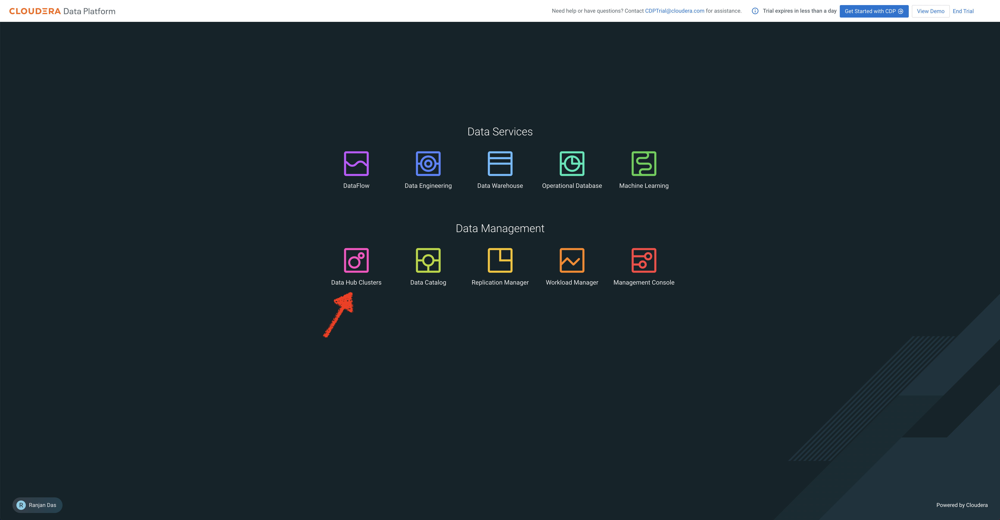
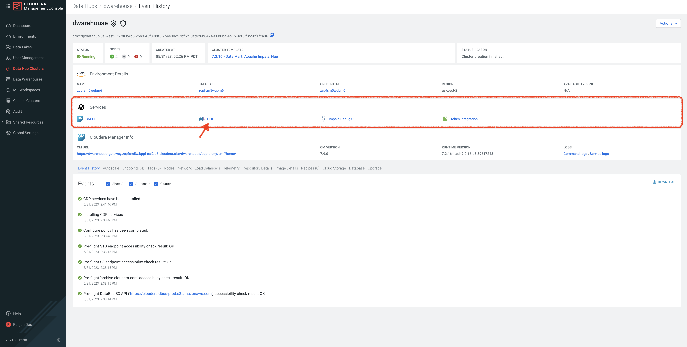
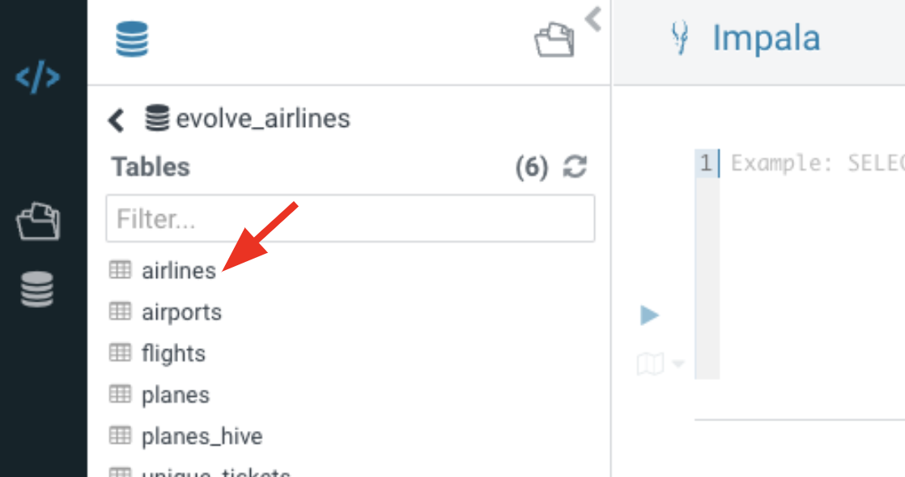
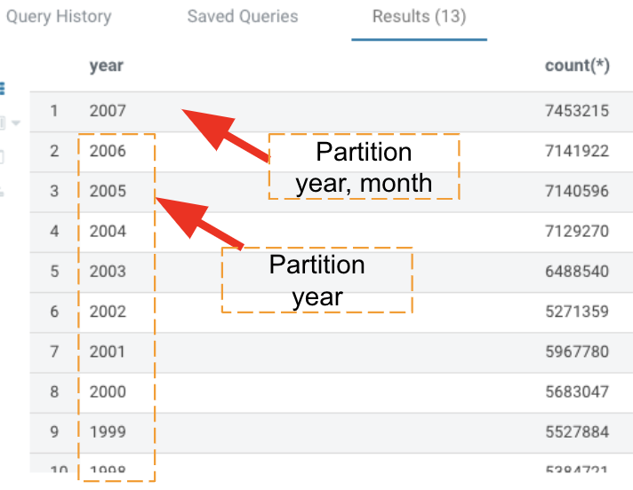
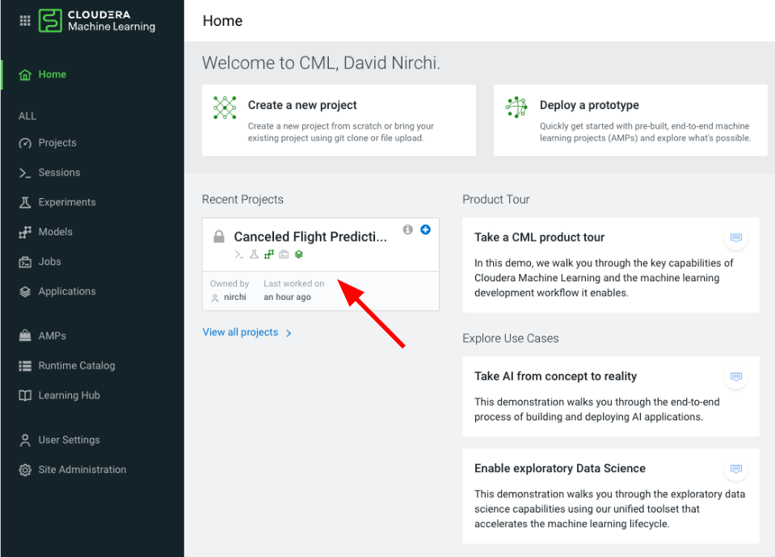
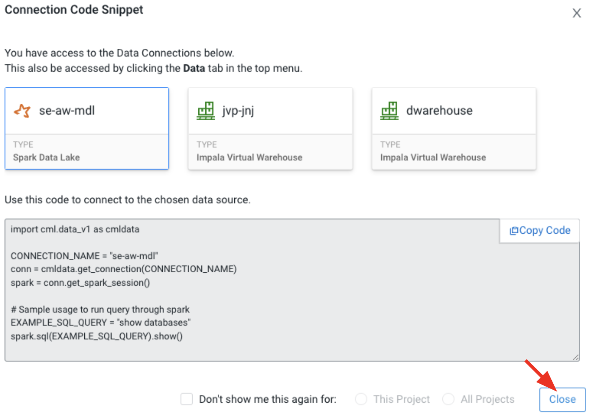
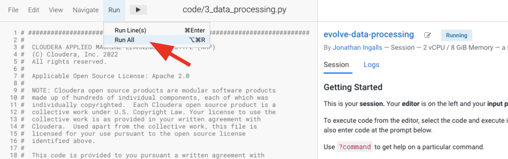

# Iceberg Capabilities 

In this phase: 
   * We will test some cool features of Iceberg in Impala including in-place Table Evolution features - Partition & Schema, and Time Travel
   * Modify the CML Project `Canceled Flight Prediction` to use the airlines data from the Data Lakehouse instead of the data that is included with the AMP that was deployed.  This simulates how you can use the AMPs to get a starting point and modify to fit your use case.


## Prerequisites

1. Please ensure that you have completed [00_prereqs](00_prereqs.md) to deploy the Applied Machine Learning Prototype (AMP) for `Canceled Flight Prediction`.
2. Please ensure that you have completed [01_ingest](01_ingest.md#01_ingest) to ingest the data needed for Visualizations.

## Lab 1: Schema Evolution 

1. Open HUE - SQL Editor
   * In your CDP Home Page, click on **Data Hub Clusters**. (For more information about Data Hub, here is a [product tour](https://www.cloudera.com/products/data-hub/cdp-tour-data-hub.html))

   

2. On the Data Hub Clusters landing page - 

   a. Note the **Environment Name** as it will be used as one of the inputs while we create tables
   
   b. Click on the Data Hub called `dwarehouse`.

   

3. In the list of Services in the Data Hub, click on **Hue** to open a new browser tab for the Impala query user interface in Hue.

   

4. In the table browser viewer (left side of screen) navigate to your `<prefix>_airlines` database
   * Click `<` to the left of `default` database


   * In the list under `Databases` click on your `<prefix>_airlines` database


      * If you don't see your database, click the refresh button to the right of `Databases`

5. Click `airlines` table under `Tables` to see columns in this table


   * The current table that we created in `01_ingest` has 2 columns: `code` and `description`

6. **In-place Schema Evolution Feature**

```
ALTER TABLE ${prefix}_airlines.airlines ADD COLUMNS(status STRING, updated TIMESTAMP);
```


   * The existing table data is **not modified** with this statement

7. Refresh table browser to see new columns added
   * Click on the refresh button to the right of `Tables`
   * Click `airlines` table to see the new columns: `status` and `updated`


8. Add data into the new schema for `airlines` table

```
INSERT INTO ${prefix}_airlines.airlines
VALUES("Z999","Adrenaline Airways","NEW",now());
```

9. Query `airlines` table to see old and new schema data

```
SELECT * FROM airlines WHERE code > "Z";
```
   * As you scroll through the results you will see the 2 columns that we added will contain "NULL" values for the data that was already in the table and the new record we inserted will have value in the new columns `status` and `updated`


## Lab 2: Partition Evolution 

1. Remain in the SQL Editor

2. See current Partition details

```
DESCRIBE FORMATTED ${prefix}_airlines.flights;
```


   * The flights Iceberg table is currently partitioned by `year`

3. **In-place Partition Evolution Feature**


```
ALTER TABLE ${prefix}_airlines.flights
SET PARTITION spec ( year, month );

DESCRIBE FORMATTED ${prefix}_airlines.flights;
```


   * In the output - Partition information is now updated with both year and month
   * The data in the `flights` table is **not rewritten**
   * When new data is written to this table it will use the new partition to write the new data

4. Load Data into Iceberg Table using the **new Partition** of year and month

```
INSERT INTO ${prefix}_airlines.flights
 SELECT * FROM ${prefix}_airlines_raw.flights
 WHERE year = 2007;
```

5. Check to see the new data for year=2007 has loaded successfully

```
SELECT year, count(*) 
FROM ${prefix}_airlines.flights
GROUP BY year
ORDER BY year desc;
```

   * You will see I didn't have to do anything special to the SQL, and it returns data from both partition definitions


6. Explain plan for the following query for year=2006 which will be using the first partition we created on `year`

```
EXPLAIN
SELECT year, month, count(*) 
FROM ${prefix}_airlines.flights
WHERE year = 2006 AND month = 12
GROUP BY year, month
ORDER BY year desc, month asc;
```


   * In the output you will see that the entire year of 2006 data needs to be scanned, which is ~127MB

3. Explain plan for the following query for year=2007 which will be using the **new** partition we created with `year` and `month`

```
EXPLAIN
SELECT year, month, count(*) 
FROM ${prefix}_airlines.flights
WHERE year = 2007 AND month = 12
GROUP BY year, month
ORDER BY year desc, month asc;
```

   * In the output you will see that just the month of December for year 2007 needs to be scanned, which is approximately 11MB
   * What happened in this query is we were able to leverage partition pruning to eliminate all of the partitions outside of `year=2007 and month=12` (ie. all data in years 1995 to 2006 and all months in 2007, except December).  This can lead to considerable gains in performance


## Lab 3: Time Travel

1. Use `DESCRIBE HISTORY` to bring back details for all Snapshots that have been created

```
DESCRIBE HISTORY ${prefix}_airlines.flights;
```


   * There are 2 rows returned
   * Each row represents a Snapshot, snapshots are automatically created when data changes occur in a table
      * The first row is the initial time this table was loaded in [01_ingest Lab 2](01_ingest.md#lab-2-create-an-open-data-lakehouse-powered-by-apache-iceberg-needed-for-analysis-and-prediction) this was data for flights before 2007
      * The second row represents the data that was loaded in [Lab 2](05_iceberg.md#lab-2-partition-evolution) after Partition Evolution which is flights for year 2007

2. Explore Time Travel using a relative Date Time
   * In the `create_ts` prompt box enter at date that is greater than the 2nd row `creation_time` column

```
SELECT year, count(*) 
FROM ${user_id}_airlines.flights
  FOR SYSTEM_TIME AS OF '${create_ts}'
GROUP BY year
ORDER BY year desc;
```
   * This will return all data through 2007.  This shows that you can use a relative timestamp and Iceberg will chosse the closest Snapshot to that date


3. Explore Time Travel using the Snapshot ID
   * In the `snapshot_id` prompt box enter the value in the 1st row `snapshot_id` column

```
SELECT year, count(*) 
FROM ${user_id}_airlines.flights
  FOR SYSTEM_VERSION AS OF ${snapshot_id}
GROUP BY year
ORDER BY year desc;
```

   * This will return all data through 2006.  For Snapshot


## Lab 4: Use Data Lakehouse data for Data Processing to re-train the Model

1. Open Cloudera Machine Learning (CML)

    - If you just completed Lab 3, on your browser click on the `Cloudera Management Console` tab


    - Go back to the CDP Home Page by clicking the bento menu icon in the top left corner, click on `Home`

    
    - Select the `Machine Learning` tile, and click on the available Workspace on the Machine Learning page (found under the `Workspace` column).


2. Open Project `Canceled Flight Prediction`
   * Click on the project `Canceled Flight Prediction` tile that was created in [00_prereqs](00_prereqs.md).

    
3. Explore the Data Processing code used to train the `Canceled Flight Prediction` Model
   * Click on `Files` in left nav

   * Click on the directory `code`


5. Open the file `3_data_processing.py` in preview
   * This is the code used to pre-process the data by wrangling the data as needed into the format to train the model


6. Scroll to the bottom of the code until you see the following

`
if __name__ == "__main__":

    if os.environ["STORAGE_MODE"] == "external":
        main()
    else:
        print(
            "Skipping 3_data_processing.py because excution is limited to local storage only."
        )
        pass
`

   * From this code we can see that it is checking the Environment variable `STORAGE_MODE`


7. Scroll up to the line `def main():`
   * Within this code block  you can see that it is using Evironment Variable we set when deploying the AMP
   * There are 2 in particular the DW_DATABASE and DW_TABLE, if you remember we set these to our Data Lakehouse `flights` Iceberg table
   * Please familiarize yourself with the rest of the code to see some of the data wrangling that is done here


8. Click `<- Project` to return to the project


8. Switch to `External` mode
   * Click on `Project Settings` on the left nav
   * Click on the `Advanced`
   * Under `Evnrionment Variables` change the value for the `STORAGE_MODE` to `external`


9. Go
   * Click on `Files` in left nav

   * Click on the directory `code`

   * Open the file `3_data_processing.py` in preview


10. Start New Session - replace &lt;prefix> with your prefix you've been using
   * Name: &lt;prefix>-data-processing-session
   * Under `Runtime`
      * Editor: Workbench (however, other Editors are available)
      * Kernel: Python 3.9
      * Edition: Standard
      * Version: leave default value here
   * Enable Spark: make sure this is active, and select Spark 3.2.3 (minimum: Spark 3 is required for Iceberg functionality)
   * Resource Profile: select a larger profile, if available select the one for 4 vCPUs and 8 GiB Memory
   * Click `Start Session`


   * Click `Close` on the Connection Code Snipet


11. Click on Run > Run All


   * IN the output window on the right half of the screen, you should see 
      * The schema of the `<prefix>_airlines.flights` table after it is queried into a DataFrame
      * The number of records returned from the `flights` table, value will be over 82 million
      * The schema of the input data that will be used to train the prediction model with our Data Lakehouse data


**Conclusion:** not sure what to put here yet 

