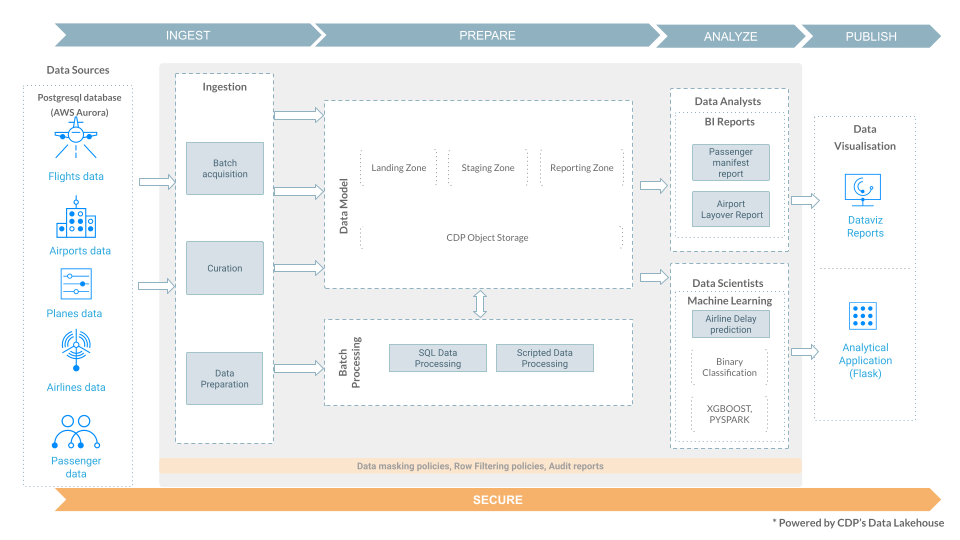
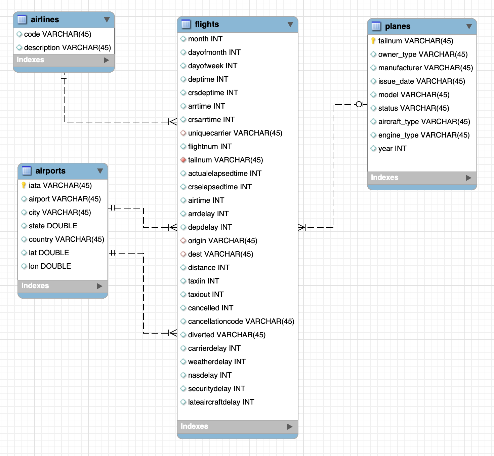

# Cloudera Data Platform (CDP) Public Cloud Trial

## Welcome to the **All in One Data Lakehouse** tutorial! 

In this tutorial, we'll guide you through constructing an Open Data Lakehouse, starting with raw source data. You'll gain practical insights into how to efficiently ingest data, transform raw information, create tailored datasets for dashboarding and reporting, and develop a predictive model using historical records.

These labs will showcase CDP's user-friendly features and robust capabilities, allowing organizations to effectively manage, analyze, and extract valuable insights from their data, regardless of its structure or source. Let's embark on this journey into the realm of data-driven success together.

For our tutorial, we will use a raw airlines dataset to -

0. [Pre-reqs](00_prereqs.md) - Set up CDP user workload password and deploy the Applied Machine Learning Prototype (AMP) for `Canceled Flight Prediction`
1. [Ingest](/01_ingest.md) - Build an ingestion data pipeline to enable advanced analytics and Machine Learning (ML) use cases
2. [Analyze](/02_analyze.md) - Explore the ingested data and conduct an interactive analysis
3. [Visualize](/03_visualize.md) - Create a visualization dashboard and deploy an ML project
4. [Predict](/04_predict.md) - Predict the likelihood of a flight being canceled based on historical records
5. [Do More with Iceberg](/05_iceberg.md) - Test Iceberg features such as Time Travel and Partition Evolution, and change the ML Project to train the `Canceled Flight Prediction` model using the Data Lakehouse (Iceberg) data

### Further Exploration

Learn how to use an open-source pre-trained instruction-following LLM (Large Language Model) to build a ChatBot-like web application. The responses of the LLM are enhanced by giving it context from an internal knowledge base. This context is retrieved by using an open-source Vector Database to do a semantic search.

- [LLM Chatbot Augmentation with Enterprise Data](llm_chatbot.md)

### Use Case Reference Architecture:

**Data Model:**

