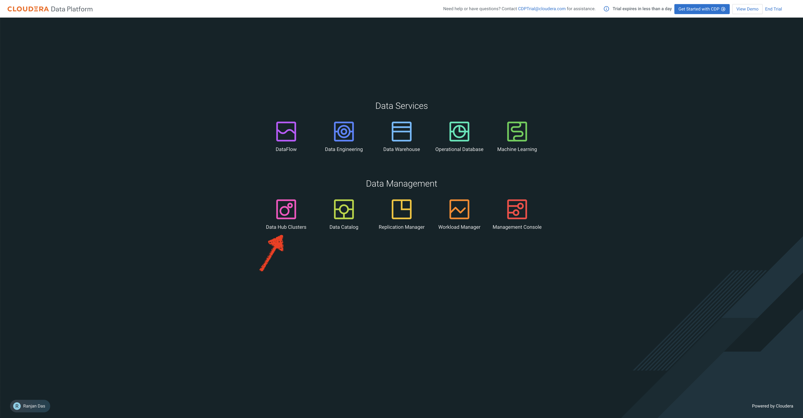
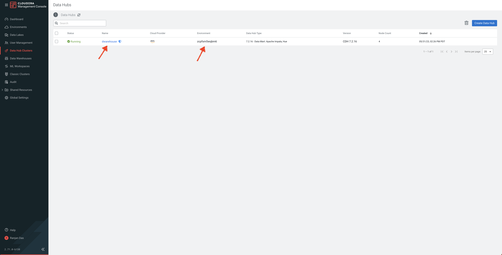
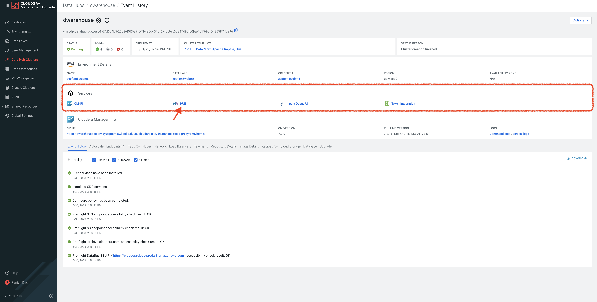

# Iceberg Capabilites 

In this lab, we will test some cool features of Iceberg in Impala including In-place Table Evolution features, Time Travel, ACID etc.

## Lab 1: Ingest data 

1. In your CDP Home Page, click on **Data Hub Clusters**. (For more information about Data Hub, here is a [product tour](https://www.cloudera.com/products/data-hub/cdp-tour-data-hub.html))



2. In the Data Hub Clusters landing page - 

   a. **Note the Environment Name** as it will be used as one of the inputs while we create tables
   
   b. Click on the Data Hub called **dwarehouse**. 



3. In the list of Services in the Data Hub, click on **Hue** to access Impala.



4. You will be taken to Impala Editor. Create databases called **airlines_csv** and **airlines** using the below queries - 

```
CREATE DATABASE airlines;
CREATE DATABASE airlines_csv;
```

5. Create **flights_csv** table from csv stored in S3

```

DROP TABLE IF EXISTS airlines_csv.flights_csv;

CREATE EXTERNAL TABLE airlines_csv.flights_csv (month int, dayofmonth int, dayofweek int, deptime int, crsdeptime int, arrtime int, crsarrtime int, uniquecarrier string, flightnum int, tailnum string, actualelapsedtime int, crselapsedtime int, airtime int, arrdelay int, depdelay int, origin string, dest string, distance int, taxiin int, taxiout int, cancelled int, cancellationcode string, diverted string, carrierdelay int, weatherdelay int, nasdelay int, securitydelay int, lateaircraftdelay int, year int)
ROW FORMAT DELIMITED FIELDS TERMINATED BY ',' LINES TERMINATED BY '\n'
STORED AS TEXTFILE LOCATION 's3a://${cdp_environment_name}/trial-odlh-data/airline-demo-data/flights' tblproperties("skip.header.line.count"="1");

```

* In **cdp_environment_name** field, enter the environment name you captured earlier

6. Create **planes_csv** table from csv stored in S3

```
DROP TABLE IF EXISTS airlines_csv.planes_csv;

CREATE EXTERNAL TABLE airlines_csv.planes_csv (tailnum string, owner_type string, manufacturer string, issue_date string, model string, status string, aircraft_type string, engine_type string, year int)
ROW FORMAT DELIMITED FIELDS TERMINATED BY ',' LINES TERMINATED BY '\n'
STORED AS TEXTFILE LOCATION 's3a://${cdp_environment_name}/trial-odlh-data/airline-demo-data/planes' tblproperties("skip.header.line.count"="1");

```
7. Create **airlines_csv** table from csv stored in S3

```
DROP TABLE IF EXISTS airlines_csv.airlines_csv;

CREATE EXTERNAL TABLE airlines_csv.airlines_csv (code string, description string) 
ROW FORMAT DELIMITED FIELDS TERMINATED BY ',' LINES TERMINATED BY '\n'
STORED AS TEXTFILE LOCATION 's3a://${cdp_environment_name}/trial-odlh-data/airline-demo-data/airlines/' tblproperties("skip.header.line.count"="1");
```

8. Create **airports_csv** table from csv stored in S3

```
DROP TABLE IF EXISTS airlines_csv.airports_csv;

CREATE EXTERNAL TABLE airlines_csv.airports_csv (iata string, airport string, city string, state DOUBLE, country string, lat DOUBLE, lon DOUBLE)
ROW FORMAT DELIMITED FIELDS TERMINATED BY ',' LINES TERMINATED BY '\n'
STORED AS TEXTFILE LOCATION 's3a://${cdp_environment_name}/trial-odlh-data/airline-demo-data/airports' tblproperties("skip.header.line.count"="1");

```

9. Create **unique_tickets_csv** table from csv stored in S3

```
DROP TABLE IF EXISTS airlines_csv.unique_tickets_csv;

CREATE external TABLE airlines_csv.unique_tickets_csv (ticketnumber BIGINT, leg1flightnum BIGINT, leg1uniquecarrier STRING, leg1origin STRING,   leg1dest STRING, leg1month BIGINT, leg1dayofmonth BIGINT,   
 leg1dayofweek BIGINT, leg1deptime BIGINT, leg1arrtime BIGINT,   
 leg2flightnum BIGINT, leg2uniquecarrier STRING, leg2origin STRING,   
 leg2dest STRING, leg2month BIGINT, leg2dayofmonth BIGINT,   leg2dayofweek BIGINT, leg2deptime BIGINT, leg2arrtime BIGINT ) 
ROW FORMAT DELIMITED FIELDS TERMINATED BY ',' LINES TERMINATED BY '\n' 
STORED AS TEXTFILE LOCATION 's3a://${cdp_environment_name}/trial-odlh-data/airline-demo-data/unique_tickets' 
tblproperties("skip.header.line.count"="1");
```

10. Create Hive Table Format stored as Parquet (to be used further down to query alongside Iceberg Table)

```
DROP TABLE IF EXISTS airlines.unique_tickets;

CREATE EXTERNAL TABLE airlines.unique_tickets (
  ticketnumber BIGINT, leg1flightnum BIGINT, leg1uniquecarrier STRING,
  leg1origin STRING,   leg1dest STRING, leg1month BIGINT,
  leg1dayofmonth BIGINT, leg1dayofweek BIGINT, leg1deptime BIGINT,
  leg1arrtime BIGINT, leg2flightnum BIGINT, leg2uniquecarrier STRING,
  leg2origin STRING, leg2dest STRING, leg2month BIGINT, leg2dayofmonth BIGINT,
  leg2dayofweek BIGINT, leg2deptime BIGINT, leg2arrtime BIGINT 
) 
STORED AS PARQUET 
TBLPROPERTIES ('external.table.purge'='true');

INSERT INTO airlines.unique_tickets
  SELECT * FROM airlines_csv.unique_tickets_csv;

```

11. **Create Iceberg Table Feature**

* Create Table as Select (CTAS) - create new table

```
DROP TABLE IF EXISTS airlines.planes;

CREATE EXTERNAL TABLE airlines.planes 
STORED AS ICEBERG 
TBLPROPERTIES ('external.table.purge'='true')
AS SELECT * FROM airlines_csv.planes_csv;

DESCRIBE FORMATTED airlines.planes;

DROP TABLE IF EXISTS airlines.airports;

CREATE EXTERNAL TABLE airlines.airports
STORED BY ICEBERG
TBLPROPERTIES ('external.table.purge'='true')
AS SELECT * FROM airlines_csv.airports_csv;

DESCRIBE FORMATTED airlines.airports;

```
In the output - look for table_type in the Table Parameters section to ensure that the table is in “ICEBERG” format

* Create table (partitioned) feature

```
DROP TABLE IF EXISTS airlines.flights;

CREATE TABLE airlines.flights (
 month int, dayofmonth int, 
 dayofweek int, deptime int, crsdeptime int, arrtime int, 
 crsarrtime int, uniquecarrier string, flightnum int, tailnum string, 
 actualelapsedtime int, crselapsedtime int, airtime int, arrdelay int, 
 depdelay int, origin string, dest string, distance int, taxiin int, 
 taxiout int, cancelled int, cancellationcode string, diverted string, 
 carrierdelay int, weatherdelay int, nasdelay int, securitydelay int, 
 lateaircraftdelay int
) 
PARTITIONED BY (year int)
STORED AS ICEBERG;

SHOW CREATE TABLE airlines.flights;

```
In the output - look for the following - PARTITIONED BY SPEC as year, table_type is ICEBERG


* Load Data into Partitioned Iceberg Table

```
INSERT INTO airlines.flights
 SELECT * FROM airlines_csv.flights_csv
 WHERE year <= 2006;
```

* Query Partitioned Iceberg Table

```
SELECT year, count(*) 
FROM airlines.flights
GROUP BY year
ORDER BY year desc;
```

* Partition Evolution

```
ALTER TABLE airlines.flights
SET PARTITION spec ( year, month );

SHOW CREATE TABLE airlines.flights;
```
In the output - PARTITIONED BY SPEC is now updated with year and month

* Load Data into Iceberg Table using NEW Partition
```

INSERT INTO airlines.flights
 SELECT * FROM airlines_csv.flights_csv
 WHERE year = 2007;
```


