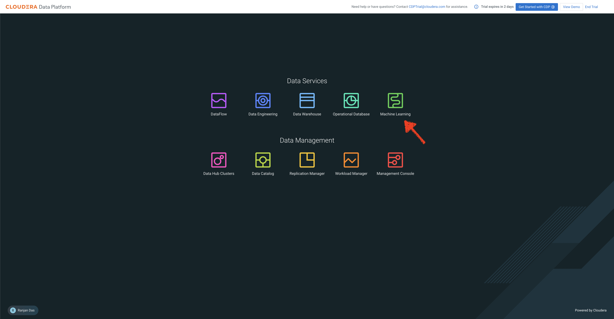

# LLM Chatbot Augmented with Enterprise Data 

In this lab, we will go through steps to build a LLM Chatbot using Cloudera Machine Learning (CML)

1. Select Machine Learning in Cloudera Data Platform Home Page

2. Click on the workspace available in your Machine Learning Page 

3. [Here](https://app.getreprise.com/launch/MXxjDe6/) is a Reprise Demo with step by step tutorial to build the LLM Chatbot

[Here](https://github.com/cloudera/CML_AMP_LLM_Chatbot_Augmented_with_Enterprise_Data) is more detailed information of the LLM Chatbot

Send a note to cdptrial@cloudera.com for any questions you have!
